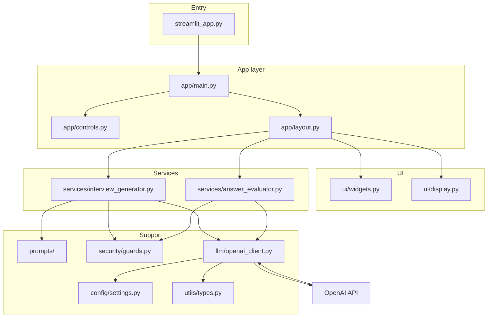
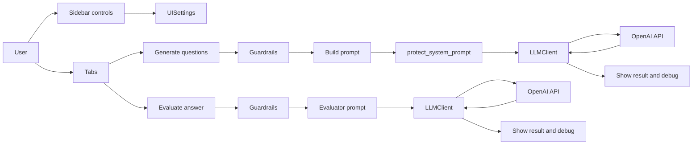

# Interview Practice App — Development Overview & Architecture

This document explains what has been developed (step-by-step), how the app is structured and connected, and what each file and script does.

---

## 1. Project context and requirements

**Purpose:** AI-powered interview practice: generate tailored interview questions and get coaching-style feedback on answers.

**Tech stack:** Python 3.11+, Streamlit (web UI), OpenAI API. Configuration via `.env`; pydantic-settings for typed settings.

**Features:**

- **5 prompt strategies:** zero_shot, few_shot, chain_of_thought, structured_output, role_based — selectable in the sidebar to compare outputs.
- **Model selection:** gpt-4.1, gpt-4.1-mini, gpt-4.1-nano, gpt-4o, gpt-4o-mini.
- **Tunable LLM settings:** temperature and max tokens in the sidebar, passed to the OpenAI client.
- **Security guardrails:** length/empty checks, prompt-injection heuristics, secret redaction; requests can be blocked and the result shown in the UI.
- **Debug view:** optional “Show debug” to see system + user prompts and settings used for each run.

---

## 2. Step-by-step: what was developed

| Step | What was built |
|------|----------------|
| 1 | **Repository scaffold** — `src/`, `app/`, `prompts/`, `services/`, `llm/`, `security/`, `utils/`, `config/`, `ui/`, `tests/`, `docs/`; clear separation of prompts, LLM client, UI, and security. |
| 2 | **Python environment** — `requirements.txt`, venv instructions, tooling (pytest, ruff, black, mypy). |
| 3 | **Configuration** — `.env` / `.env.example`, `config/settings.py` with pydantic-settings (OPENAI_API_KEY, OPENAI_MODEL, APP_ENV, etc.). |
| 4 | **OpenAI client** — `llm/openai_client.py` (wrapper: model, temperature, top_p, max_tokens; system + user prompts); `llm/model_settings.py` for presets. |
| 5 | **Prompt engineering** — `prompts/prompt_templates.py` loads `.md` from `prompts/templates/`; `prompts/prompt_strategies.py` builds system+user prompts for all five strategies. |
| 6 | **Security** — `security/guards.py`: input validation, prompt-injection detection, secret redaction, `protect_system_prompt`. |
| 7 | **Services** — `services/interview_generator.py` (generate questions via chosen strategy); `services/answer_evaluator.py` (evaluate Q&A with fixed evaluator prompt). |
| 8 | **Streamlit UI** — `streamlit_app.py` (entry, path setup, load_dotenv) → `app/main.py`; sidebar in `app/controls.py`; tabs in `app/layout.py` (Question generation, Answer feedback, Mock interview placeholder); `ui/widgets.py` and `ui/display.py` for inputs and result/debug display. |
| 9 | **Testing** — `tests/conftest.py` adds `src/` to path; unit tests (config, guardrails, prompt strategies); integration smoke test for OpenAI client (skips without API key). |
| 10 | **Docs and scripts** — README, `docs/architecture.md`, `docs/development.md`; Makefile (install, run, test, lint, format, typecheck). |

---

## 3. Architecture and how everything connects

### 3.1 Component structure

Entry point is `streamlit_app.py`, which sets up `src/` on `sys.path`, loads `.env`, then calls `app.main.run()`. The app layer renders header, sidebar controls (yielding `UISettings`), and tabs. Each tab that does LLM work calls into services; services use prompts, guardrails, and the LLM client. Config and shared types are used across layers.

### 3.2 Data flow

- **User → UI:** Sidebar and tabs collect interview type, role, seniority, prompt strategy, model, temperature, max_tokens, and optional job description / question / answer. These are passed as `UISettings` and raw inputs into the layout.
- **Generate questions:** Layout calls `generate_questions()` with sidebar settings and job description. Service runs guardrails on job_description and role_title; builds prompt via the selected strategy; appends security suffix to system prompt; calls `LLMClient.generate_response()`; returns result (and optional prompt for debug). Layout shows guardrail summary, error if blocked, or LLM response and debug expanders.
- **Evaluate answer:** Layout calls `evaluate_answer()` with question and answer. Service runs guardrails on both; builds evaluator system + user prompt; calls `LLMClient.generate_response()`; returns result. Layout shows guardrail summary, error if blocked, or evaluation and debug expanders.

### 3.3 File-level dependencies (high level)

- `streamlit_app.py` → `app.main`
- `app.main` → `app.controls`, `app.layout`
- `app.layout` → `services.interview_generator`, `services.answer_evaluator`, `ui.widgets`, `ui.display`
- `interview_generator` → `prompts.prompt_strategies`, `security.guards`, `llm.openai_client`, `utils.types`
- `answer_evaluator` → `security.guards`, `llm.openai_client`, `utils.types`
- `prompt_strategies` → `prompts.prompt_templates`
- `openai_client` → `config.settings`, `llm.model_settings`, `utils.types`
- `app.controls` → `llm` (MODEL_PRESETS), `prompts.prompt_templates`

See also [architecture.md](architecture.md) for module boundaries and [development.md](development.md) for commands and adding prompt strategies.

---

## 4. File and script reference

### Root

| File | Role |
|------|------|
| `streamlit_app.py` | Entry point for `streamlit run`. Adds `src/` to `sys.path`, loads `.env` from project root, calls `interview_app.app.main.run()`. |
| `requirements.txt` | Python dependencies: streamlit, openai, python-dotenv, pydantic, pydantic-settings; pytest, ruff, black, mypy. |
| `.env.example` | Template for environment variables (OPENAI_API_KEY, OPENAI_MODEL, OPENAI_TEMPERATURE, APP_ENV). Copy to `.env` and set real key. |
| `Makefile` | Targets: install, run, test, lint, format, typecheck. |
| `README.md` | Project overview, setup, run, tests, lint/format/typecheck, reviewer notes. |

### Config

| File | Role |
|------|------|
| `src/interview_app/config/settings.py` | Pydantic-settings `Settings` (app_env, openai_api_key, openai_model, openai_temperature). `get_settings()` cached. |
| `src/interview_app/config/__init__.py` | Package init. |

### LLM

| File | Role |
|------|------|
| `src/interview_app/llm/openai_client.py` | `LLMClient`: wrapper around OpenAI SDK; `generate_response(system_prompt, user_prompt, model, temperature, top_p, max_tokens)`. Uses config and model presets for defaults. Returns `LLMResponse` (text, model, usage, raw_response_id). |
| `src/interview_app/llm/model_settings.py` | `ModelConfig`, `MODEL_PRESETS` (gpt-4.1, gpt-4.1-mini, gpt-4.1-nano, gpt-4o, gpt-4o-mini), `get_model_config(key)`. |
| `src/interview_app/llm/__init__.py` | Exposes `LLMClient`, `ModelConfig`, `MODEL_PRESETS`, `get_model_config`. |

### Prompts

| File | Role |
|------|------|
| `src/interview_app/prompts/prompt_templates.py` | `list_templates()`, `load_template_text(name)`, `load_template(name)` — load `.md` from `prompts/templates/` with optional description from HTML comment. |
| `src/interview_app/prompts/prompt_strategies.py` | Builders: `build_zero_shot_prompt`, `build_few_shot_prompt`, `build_chain_of_thought_prompt`, `build_structured_output_prompt`, `build_role_based_prompt`. Each returns `PromptBuildResult(system_prompt, user_prompt, template_name)`. Strategy-specific system prompt text in `_system_prompt_for()`. |
| `src/interview_app/prompts/templates/*.md` | One `.md` per strategy (zero_shot, few_shot, chain_of_thought, structured_output, role_based); placeholders like `{interview_type}`, `{role_title}`, `{seniority}`, `{job_description}`, `{n_questions}`. |
| `src/interview_app/prompts/__init__.py` | Package init. |

### Security

| File | Role |
|------|------|
| `src/interview_app/security/guards.py` | `GuardrailResult` (ok, cleaned_text, reason, flags, injection_detected, truncated, original_length). `validate_user_input`, `detect_prompt_injection`, `sanitize_user_input`, `protect_system_prompt`, `run_guardrails` — length/empty, injection heuristics, secret redaction. |
| `src/interview_app/security/__init__.py` | Package init. |

### Utils

| File | Role |
|------|------|
| `src/interview_app/utils/types.py` | `LLMUsage`, `LLMResponse` (pydantic models for API responses). |
| `src/interview_app/utils/__init__.py` | Package init. |

### Services

| File | Role |
|------|------|
| `src/interview_app/services/interview_generator.py` | `generate_questions(...)` — runs guardrails on job_description and role_title; builds prompt via strategy; protects system prompt; calls `LLMClient.generate_response`; returns `GenerateQuestionsResult` (ok, response, error, guardrails, prompt). |
| `src/interview_app/services/answer_evaluator.py` | `evaluate_answer(...)` — runs guardrails on question and answer; fixed evaluator system + user prompt; calls `LLMClient.generate_response`; returns `EvaluateAnswerResult` (ok, response, error, guardrails, system_prompt, user_prompt). |
| `src/interview_app/services/__init__.py` | Package init. |

### App (Streamlit orchestration)

| File | Role |
|------|------|
| `src/interview_app/app/main.py` | `run()` — sets page config, calls `render_header()`, `render_sidebar_controls()` (returns `UISettings`), `render_instructions()`, `render_tabs(settings)`. |
| `src/interview_app/app/controls.py` | `render_sidebar_controls()` — sidebar: interview type, role title, seniority, prompt strategy, model preset, temperature, max_tokens, “Show debug”. Returns `UISettings`. |
| `src/interview_app/app/layout.py` | `render_header()`, `render_instructions()`, `render_tabs(settings)` — tabs “Question generation”, “Answer feedback”, “Mock interview”; buttons call services and use `ui.display` / `ui.widgets` for I/O and errors. |
| `src/interview_app/app/__init__.py` | Package init. |

### UI

| File | Role |
|------|------|
| `src/interview_app/ui/widgets.py` | `job_description_input()`, `question_context_input()`, `answer_input()` — Streamlit text areas. |
| `src/interview_app/ui/display.py` | `show_error`, `show_llm_response`, `show_guardrail_summary`, `show_prompt_debug`, `show_settings_debug` — success/error and expanders for metadata, guardrails, prompts, settings. |
| `src/interview_app/ui/__init__.py` | Package init. |

### Tests

| File | Role |
|------|------|
| `tests/conftest.py` | Pytest hook: add project `src/` to `sys.path` so `interview_app` is importable. |
| `tests/unit/test_config.py` | Unit tests for `Settings` defaults and env overrides. |
| `tests/unit/test_guardrails.py` | Unit tests for guardrail functions (validation, injection detection, sanitization, run_guardrails). |
| `tests/unit/test_prompt_strategies.py` | Unit tests for prompt strategy builders (output shape, template usage). |
| `tests/integration/test_openai_client_smoke.py` | Smoke test for `LLMClient.generate_response`; skips if `OPENAI_API_KEY` not set. |

### Docs

| File | Role |
|------|------|
| `docs/architecture.md` | Module boundaries and data-flow diagram. |
| `docs/development.md` | Environment, commands (install, run, test, lint, format, typecheck), conventions, adding a new prompt strategy. |
| `docs/PROJECT_OVERVIEW.md` | This file — development story, architecture, and file reference. |
