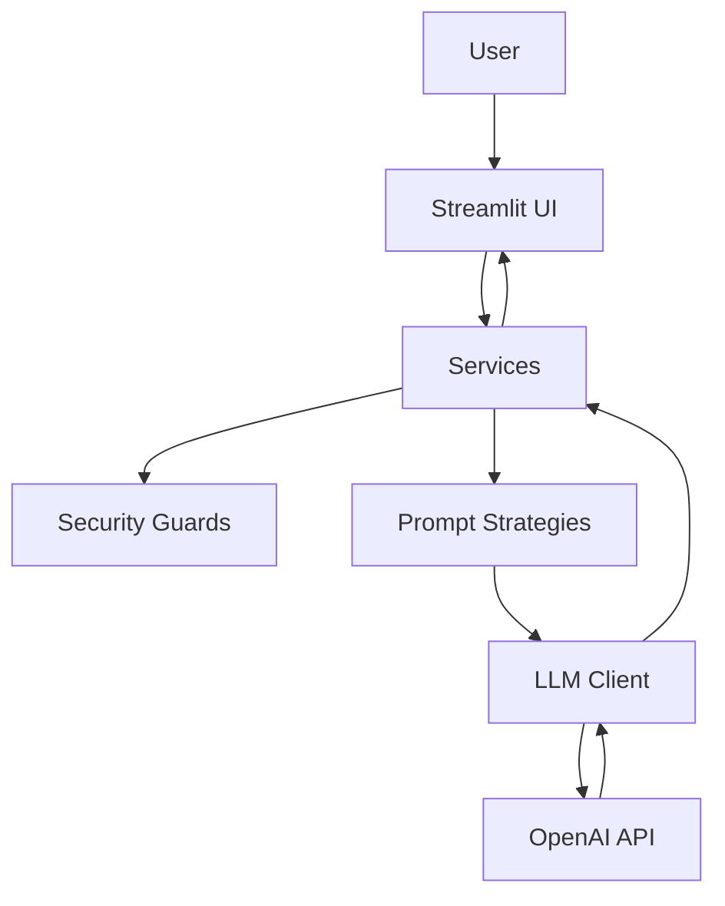

# Architecture

## Module boundaries

- `streamlit_app.py`
  - Entry point for `streamlit run ...`
  - Ensures `src/` is on `sys.path` so imports work with the `src/` layout
- `src/interview_app/app/`
  - Streamlit page wiring (layout, controls, main orchestration)
- `src/interview_app/ui/`
  - Reusable UI widgets and display helpers (pure UI concerns)
- `src/interview_app/services/`
  - Domain logic: generate questions, evaluate answers (UI calls into services)
- `src/interview_app/prompts/`
  - Prompt templates and prompt-building strategies
- `src/interview_app/llm/`
  - OpenAI SDK wrapper and model presets
- `src/interview_app/security/`
  - Input validation and simple guardrails
- `src/interview_app/config/`
  - Settings loader from environment / `.env`
- `src/interview_app/utils/`
  - Shared types and helper utilities

## Data flow

## Notes

- The UI should stay thin: most logic belongs in `services/`.
- `security/` runs before calling the LLM (length checks, prompt-injection heuristics, etc.).
- Prompt templates live under `prompts/templates/` and are composed by `prompts/prompt_strategies.py`.

