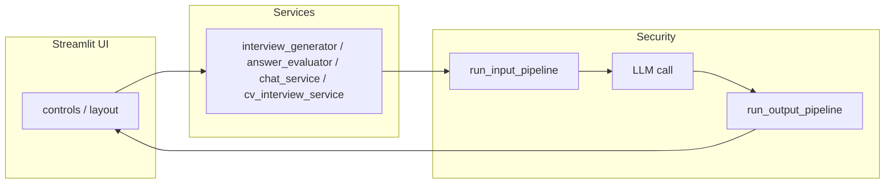

# Architecture

This document describes how the Interview App is layered, how data flows from the UI to the LLM, and where to add new behavior without breaking separation of concerns.

---

## Design goals

- **Thin UI:** Streamlit modules orchestrate layout and session state; they delegate to services for anything that touches prompts, guardrails, or the OpenAI API.
- **Single guardrail path:** All user-visible and file-derived text that reaches the model should pass through `security/pipeline.py` (or the same checks via `run_guardrails` where a slimmer path is intentional and tested).
- **Inspectable prompts:** Prompt composition lives in `prompts/` and `cv/prompt_builders.py`, not embedded in ad hoc strings inside the UI.

---

## Layered structure

| Layer | Location | Responsibility |
|-------|----------|------------------|
| **Entry** | `streamlit_app.py` | `sys.path` for `src/`, load `.env`, invoke `app.main.run()`. |
| **App / orchestration** | `app/` | Page config, sidebar, workspace tabs, wiring services to widgets. |
| **UI presentation** | `ui/` | Theme CSS, reusable inputs, formatting of LLM output and errors. |
| **Services** | `services/` | Question generation, answer evaluation, chat turns, CV pipelines. |
| **Domain models** | `utils/types.py`, `cv/models.py` | Pydantic models shared across layers. |
| **Prompts** | `prompts/`, `cv/prompt_builders.py` | Strategies, templates, persona strings. |
| **LLM** | `llm/openai_client.py` | OpenAI SDK wrapper, audit logging, presets in `model_settings.py`. |
| **Security** | `security/` | Guards, pipeline, moderation, rate limiting, output validation, logging. |
| **Config** | `config/settings.py` | Environment-backed settings (including `SECURITY_*`). |
| **Storage** | `storage/sessions.py` | Local JSON sessions under `SESSIONS_DIR`. |

---

## Request flow (simplified)

1. User action in the UI triggers a service function with parameters derived from `UISettings` and widgets.
2. **Pre-LLM:** `run_input_pipeline` runs validation, sanitization, moderation, and (when enabled) rate limiting.
3. **LLM:** `LLMClient.generate_response` performs the API call and structured audit logging (no prompt bodies in logs).
4. **Post-LLM:** `run_output_pipeline` validates length and optional JSON expectations.

---

## Module map (selected)

| Path | Role |
|------|------|
| `app/main.py` | Composition root: theme, sidebar, main content. |
| `app/layout.py` | Hero, configuration bar, workspace tabs, chat and CV panels. |
| `app/controls.py` | Sidebar → `UISettings`. |
| `app/conversation_state.py` | Chat `session_state` helpers. |
| `app/cv_session_state.py` | CV-specific `session_state`. |
| `services/chat_service.py` | Mock interview turn routing and LLM calls. |
| `services/interview_generator.py` | Question list generation tab. |
| `services/answer_evaluator.py` | Feedback tab and structured evaluation parsing. |
| `services/cv_interview_service.py` | CV upload → extraction → structured JSON → questions/practice. |
| `security/pipeline.py` | Ordered pre/post LLM checks. |
| `storage/sessions.py` | List/load/save/delete session JSON files safely. |

---

## Prompts and strategies

- **Interview question generation:** `prompts/prompt_strategies.py` composes system and user prompts from templates in `prompts/prompt_templates.py` and selected strategy names (`zero_shot`, `few_shot`, `chain_of_thought`, `structured_output`, `role_based`). Few-shot demonstrations are focus-keyed via `prompts/few_shot_examples.py`. The sidebar **Prompt strategy** select (`app/controls.py`) maps labels to these keys on `UISettings.prompt_strategy`. `services/interview_generator.generate_questions_from_settings` centralizes wiring from `UISettings`. Structured JSON responses are parsed for display via `utils/interview_question_output.py`. The Interview Questions tab offers **Strategy Comparison**: user picks two strategies (`PROMPT_STRATEGY_OPTIONS`), runs generation twice, and views aligned results via `ui/strategy_comparison.py`; optional evaluations append to `data/strategy_comparison_evaluations.json` (`storage/strategy_comparison_evaluations.py`).
- **Answer feedback:** `answer_evaluator.py` uses a fixed coach-style system prompt (not the five strategies above).
- **Personas:** `prompts/personas.py` supplies interviewer voice for relevant flows.
- **CV:** `cv/prompt_builders.py` holds CV-specific system/user strings; models in `cv/models.py`.

Adding a new strategy: implement a builder returning `PromptBuildResult`, register it in `interview_generator._build_prompt`, add a row to `PROMPT_STRATEGY_OPTIONS` in `app/ui_settings.py`, and add a unit test for prompt shape (see [development.md](development.md)).

---

## Session persistence

Saved mock interviews are **files on disk** (`*.json` under `SESSIONS_DIR`), not a database. Paths are resolved relative to the process current working directory unless `SESSIONS_DIR` is absolute. Session IDs are validated to prevent path traversal (`storage/sessions.py`).

---

## What belongs where

- **UI:** Rendering, `st.session_state` keys, calling services with plain data.
- **Services:** Guardrails + prompt assembly + `LLMClient` + parsing structured LLM output.
- **Security:** Reusable checks; no Streamlit imports in core guard modules (pipeline accepts optional `session_state` dict for rate limiting).

For deployment topology (Docker, cloud), see [DEPLOYMENT.md](DEPLOYMENT.md).
